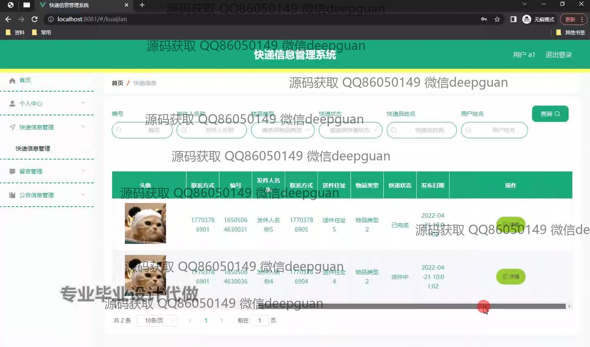
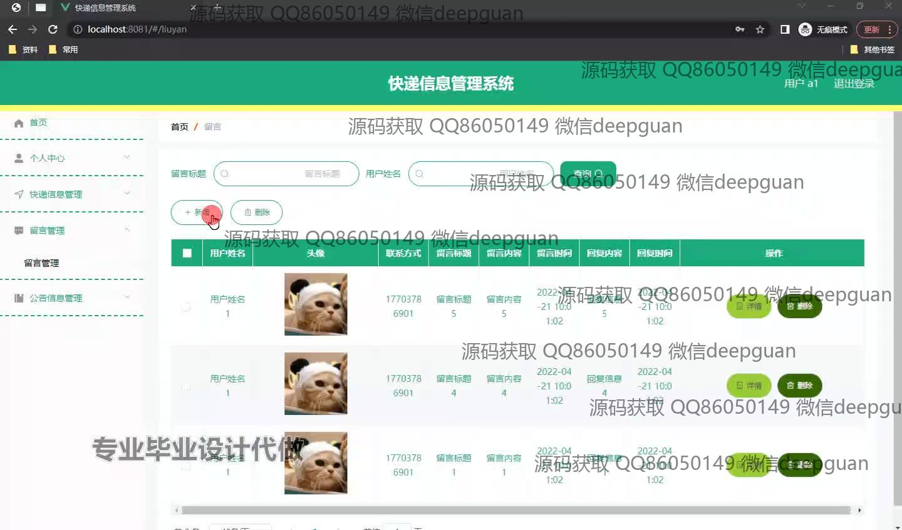
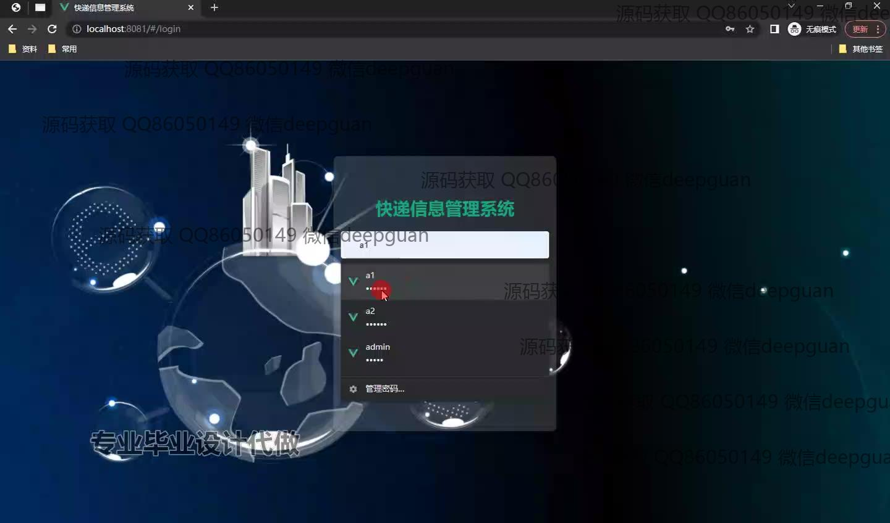
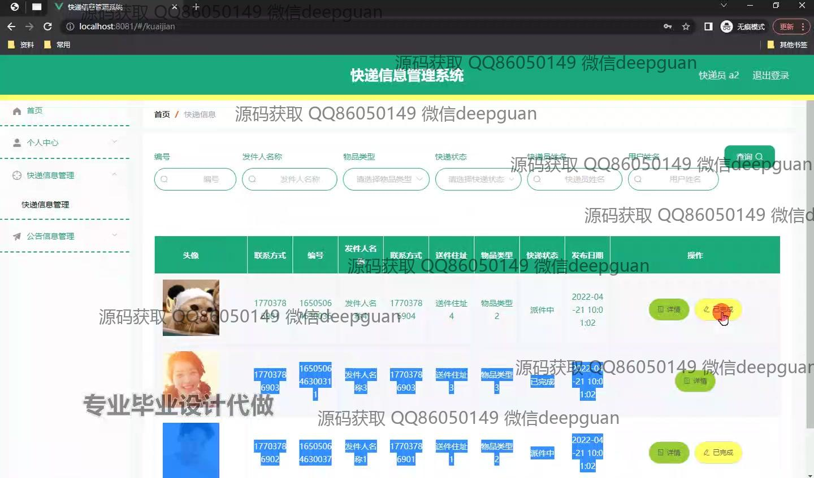
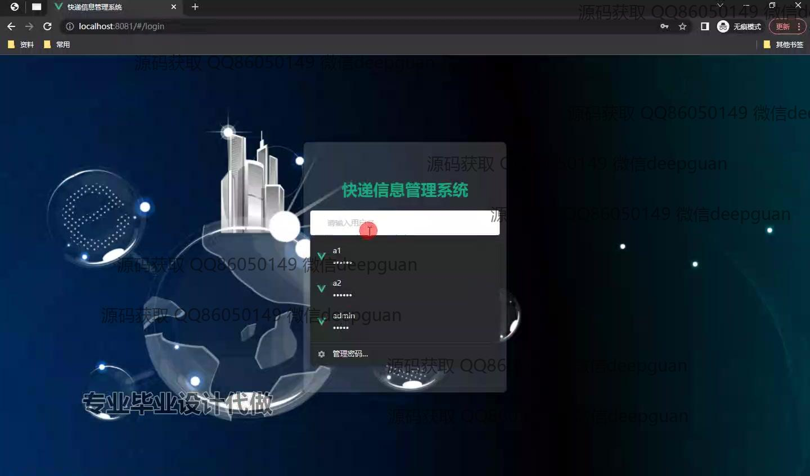
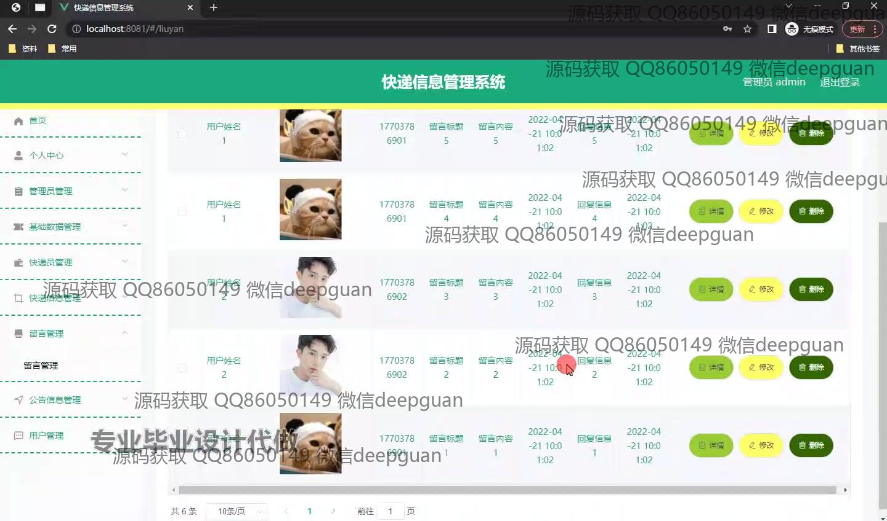

<h1 align="center">基于SSM的快递信息管理系统的设计与实现+vue</h1>

## 简介
快递信息管理系统：角色分为管理员、用户；实现快递查询、留言管理、基础数据管理、快递员管理等功能，界面现代简洁，便于用户操作与系统使用。    --计算机毕业设计源码；毕设源码；java毕业设计源码

## 联系方式

<h3 align="center">获取完整代码与数据库文件 + 微信：deepguan QQ: 86050149 QQ群: 783742310</h3>

<h3 align="center">可帮忙远程部署 包运行成功！提供远程部署、修改代码、设计文档指导、代码讲解等服务！</h3>

## 功能介绍（完整见运行截图）
管理员：基本功能包括登录、注册、退出等操作；可管理基础数据、快递员信息和用户留言，提供留言回复功能，并可查看和删除快递信息；支持系统的公告信息管理，确保数据的准确性和系统的正常运行。

快递员：支持通过筛选条件查询快递信息，包括快递编号、发件人、物品类型和状态等；可查看快递详情并执行相关操作，如更新快递状态；通过个人中心模块查看或修改个人信息。

用户：可通过登录功能进入系统，支持快递信息查询与管理，能查看快递状态及详细信息；支持在留言管理模块中提交留言与管理员沟通，同时查看留言回复内容；个人中心模块提供信息修改和快递操作记录查询功能。

访客：支持登录注册进入系统，通过管理员指定权限进行初步了解；仅能查看有限的公告信息，部分功能需登录后方可操作。

## 运行截图

本代码来源于网络,仅供学习参考使用!

